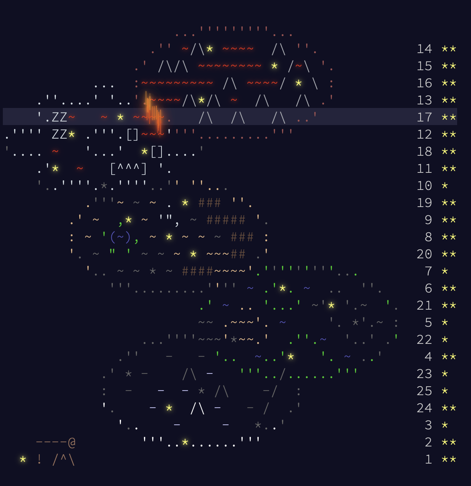

# Advent Of Code

Repository dedicated to the [Advent Of Code yearly challenge (AOC)](https://adventofcode.com/2024/about)

## 1. Usage

You have access to two executables in order to collect the daily problem automatically, and run you solutions too.

### 1.1. Installation of the virtual environment

In order to reproduce the scripts, you will need to initialize the *poetry* environment associated to the project :

```shell
# install poetry
pip3 install poetry
# restore environment from .lock file
poetry install
# activate the environment
poetry shell
```

If you do not wish to proceed like this, please just install the packages *requests* and *bs4* on your device wrt the following versions: 

```shell
bs4 = "^0.0.2"
requests = "^2.32.3"
```

### 1.2. Retrieval of the daily problem

For example, the following command : 

```shell
#./collect day year
./collect 1 2024
```

allows to retrieve all the content associated to day 1 of year 2024 : 
- *day_desc.md* : explanation of the given day problem
- *test_input.txt* : test input to validate your solution
- *real_input.txt* : final input to produce your final submission
- *solution.py* : python script template to fill with the solution

During your first query, the script will ask for your session token in order to download the input file. To get you session token, you need to follow the following steps :
- go to the website and inspect page (keep it open)
- go to the "network" section in the inspector
- login and click to "login" request in the inspector (left side)
- check for subsection "cookies" in the "network" section in inspector (right side)
- get the "session" value and paste it in the terminal

Your session token will automatically be saved in the hidden cache file *.session_cache.lock*

### 1.3. Run of your solution 

For example, the following command :

```shell
#./submit day year part(1/2) test_mode(true/false)
./submit 1 2024 1 true
```

will run you **solution.py** and collect the answer for **part 1** (third argument) for **test mode set to true** (fourth argument). 

### 1.4. Test of your solution 

For example, the following command :

```shell
#./test day year
./test 1 2024
```

will run tests for **day 1** (first argument) for **year 2024** (second argument), based on an expected output given in the day description that you need to insert in the variable **expected_output** of the file [test_day_3.py](./tests/2024/test_day_3.py):

```python
import subprocess
expected_output = {'1':"EXEPCTED SOLUTION FOR PART 1", '2':"EXEPCTED SOLUTION FOR PART 2"}
day = '3'
year = '2024'

def test_solution():
  for part in ['1','2']:
    command = ['./submit', day, year, part, 'true']
    result = subprocess.run(command, stdout=subprocess.PIPE, text=True, check=True)
    assert result.stdout == f'Result for Part=={part} & Test==True : {expected_output[part]}\n'
```

## 2. What did I learn from the past ?

### 2.1. Basic tools
- **logical operations** : *all(c for c in conditions)*, *any(c for c in conditions)* to check multiple conditions
- **numpy tools** : *np.flipud*, *np.fliplr* to get vertically/horizontally mirrored array
- **text files** : *.splitlines()*, *.read()*, *.readlines()*
- **list operations** : *map(function,list)* and *list.sort(key=lambda ...)*
- **string sequences** : *.split()*, *.lstrip()*, *.rstrip()*, *.replace()*
- **regular expressions** : find patterns with *re.findall*, *re.search* and *re.match*, *str.__contains__(expr)*
- **set** object : useful to deal with intersections, unions, difference

### 2.2. Packages 
- **[copy](https://docs.python.org/fr/3/library/copy.html)** : module *deepcopy* that allows to make a copy of an element completely detached from the original one (in terms of operations).
- **[heapq](https://docs.python.org/fr/3/library/heapq.html)** : combination of heap data type ("branch type") and deque (queue type operations). *heappop* to get the first element of the queue+ remove it from the queue at the same time. *heappush* to push a new element at the end of the queue. 
- **[collections](https://docs.python.org/fr/3/library/collections.html)** : modules such as *defaultdict* (dictionnary with enforced type), *Counter* (unique occurences,counts) *deque* (queue solving prolems with popleft, )
- **[itertools](https://docs.python.org/fr/3/library/itertools.html)** : *combinations*
- **[simpy](https://simpy.readthedocs.io/en/latest/)** : implement/solve list of equations
- **[networkx](https://networkx.org)** : graph construction, minimal cut problems

### 2.3. Methods
- **[recursion](https://www.programiz.com/python-programming/recursion)** is the process of defining a function in terms of itself. Helpful for branching/path searching problems.
- **[shoelace formula](https://en.wikipedia.org/wiki/Shoelace_formula)** allows to compute the area of a polygon given the list of its edges.
- **[Pick's Theorem](https://en.wikipedia.org/wiki/Pick%27s_theorem)** provides formula for the area of a polygon given the number of interior points and points on its boundary.
- **[Depth First Search](https://en.wikipedia.org/wiki/Depth-first_search)** is an algorithm for traversing or searching tree or graph data structures.

\
***Image of the 2023 AOC Calendar***

